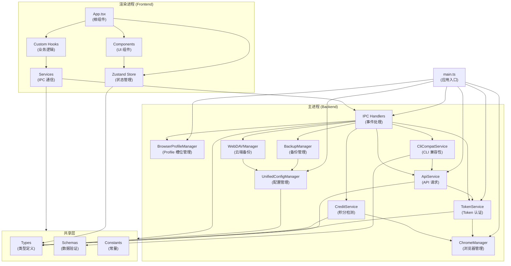

# 项目索引 - API Hub Management Tools

## 📋 项目概览

**API Hub Management Tools** 是一个现代化的桌面管理客户端，基于 Electron + React + TypeScript 构建。

**核心功能**:
- 多站点聚合管理（One API / New API / Veloera / Done Hub 等）
- 自动认证与 Token 管理
- 实时监控（余额、消耗、RPM/TPM）
- CLI 兼容性测试与自定义 CLI 配置（支持 Codex 双 API 测试、Gemini CLI 双端点测试）
- 软件更新（应用内下载、进度展示、安装触发）
- WebDAV 云端备份
- 深色模式支持

**技术栈**:
- **前端**: React 18 + TypeScript + Tailwind CSS + Vite
- **后端**: Electron + Node.js
- **测试**: Vitest + React Testing Library + fast-check (属性测试)
- **构建**: Electron Builder + Vite

---

## 📁 目录结构

```
src/
├── main/                    # Electron 主进程 (后端)
│   ├── handlers/           # IPC 事件处理器
│   ├── types/              # TypeScript 类型定义
│   ├── utils/              # 工具函数
│   ├── main.ts             # 应用入口
│   ├── api-service.ts      # API 请求服务
│   ├── chrome-manager.ts   # Chrome 浏览器管理
│   ├── token-service.ts    # Token 认证服务
│   ├── cli-compat-service.ts # CLI 兼容性测试
│   ├── backup-manager.ts   # 备份管理
│   ├── webdav-manager.ts   # WebDAV 云端备份
│   └── ...
├── renderer/               # React 前端 (UI)
│   ├── components/         # React 组件
│   ├── hooks/              # 自定义 Hooks
│   ├── services/           # 前端服务
│   ├── store/              # Zustand 状态管理
│   ├── utils/              # 工具函数
│   ├── App.tsx             # 应用根组件
│   └── main.tsx            # 前端入口
├── shared/                 # 共享代码
│   ├── constants/          # 常量定义
│   ├── schemas/            # Zod 数据验证
│   ├── types/              # 共享类型
│   └── utils/              # 共享工具
└── __tests__/              # 测试文件（含 UnifiedConfigManager 配置恢复、CLI 探测账户选择、API Key 原始值保留回归、自定义 CLI 编辑器交互回归）
```

---

## 🔄 依赖关系图


```mermaid
graph TD
    Main["main.ts<br/>(应用入口)"]
    
    subgraph MainProcess["主进程 (Backend)"]
        ChromeMgr["ChromeManager<br/>(浏览器管理)"]
        ProfileMgr["BrowserProfileManager<br/>(Profile 槽位管理)"]
        TokenSvc["TokenService<br/>(Token 认证)"]
        ApiSvc["ApiService<br/>(API 请求)"]
        CliCompat["CliCompatService<br/>(CLI 兼容性)"]
        CreditSvc["CreditService<br/>(积分检测)"]
        BackupMgr["BackupManager<br/>(备份管理)"]
        WebDAVMgr["WebDAVManager<br/>(云端备份)"]
        ConfigMgr["UnifiedConfigManager<br/>(配置管理)"]
        Handlers["IPC Handlers<br/>(事件处理)"]
    end
    
    subgraph RendererProcess["渲染进程 (Frontend)"]
        App["App.tsx<br/>(根组件)"]
        Components["Components<br/>(UI 组件)"]
        Hooks["Custom Hooks<br/>(业务逻辑)"]
        Store["Zustand Store<br/>(状态管理)"]
        Services["Services<br/>(IPC 通信)"]
    end
    
    subgraph Shared["共享层"]
        Types["Types<br/>(类型定义)"]
        Schemas["Schemas<br/>(数据验证)"]
        Constants["Constants<br/>(常量)"]
    end
    
    Main --> ChromeMgr
    Main --> ProfileMgr
    Main --> TokenSvc
    Main --> ApiSvc
    Main --> ConfigMgr
    Main --> Handlers
    
    TokenSvc --> ChromeMgr
    ApiSvc --> TokenSvc
    CliCompat --> ApiSvc
    CreditSvc --> ChromeMgr
    BackupMgr --> ConfigMgr
    WebDAVMgr --> ConfigMgr
    
    Handlers --> ApiSvc
    Handlers --> ProfileMgr
    Handlers --> TokenSvc
    Handlers --> BackupMgr
    Handlers --> WebDAVMgr
    Handlers --> CliCompat
    Handlers --> CreditSvc
    
    App --> Components
    App --> Hooks
    App --> Store
    
    Hooks --> Services
    Services --> Handlers
    
    Components --> Store
    Store --> Types
    
    ApiSvc --> Types
    TokenSvc --> Types
    CreditSvc --> Types
    CliCompat --> Schemas
    ConfigMgr --> Types
    
    Handlers --> Shared
    Services --> Shared
```

---

## 🏗️ 核心模块说明

### 主进程 (Backend)

| 模块 | 职责 | 关键方法 |
|------|------|--------|
| **main.ts** | 应用入口、窗口管理 | `createWindow()`, `app.whenReady()` |
| **ChromeManager** | 多槽位浏览器池管理（slot 0=主浏览器, slot N=隔离浏览器N），自动登录、localStorage 读取，并支持按账户 Profile 直接打开站点 | `createPage({slot})`, `cleanup()`, `forceCleanup()`, `getLocalStorageData()`, `openSiteWithProfile()` |
| **BrowserProfileManager** | 主/隔离浏览器 Profile 管理，多账户按槽位共享隔离 Profile，首次创建时仅复制 Extensions 并清理登录态 | `detectMainChromeProfile()`, `prepareIsolatedProfile()`, `deleteIsolatedProfile()` |
| **TokenService** | Token 获取、存储、刷新、签到功能（兼容 Veloera/New API） | `getToken()`, `saveToken()`, `refreshToken()`, `checkIn()` |
| **ApiService** | API 请求、错误处理、LDC 支付检测 | `request()`, `checkBalance()`, `checkStatus()`, `detectLdcPayment()` |
| **CliCompatService** | CLI 兼容性测试（流式首包探测，与真实 CLI 请求格式一致；500+JSON 判定中转站上游失败） | `testSite()`, `testCodexWithDetail()`, `testGeminiWithDetail()` |
| **CreditService** | Linux Do Credit 积分检测、LDC 充值（基于 credit.linux.do 会话） | `fetchCreditData()`, `launchLogin()`, `logout()`, `initiateRecharge()` |
| **UpdateService** | 更新检测、应用内下载、安装触发 | `checkForUpdates()`, `downloadUpdate()`, `cancelDownload()`, `installUpdate()` |
| **BackupManager** | 本地备份、恢复 | `backup()`, `restore()`, `export()` |
| **WebDAVManager** | 云端备份、同步 | `uploadBackup()`, `downloadBackup()` |
| **UnifiedConfigManager** | 配置管理、迁移、损坏恢复 | `loadConfig()`, `saveConfig()`, `tryRestoreFromBackup()` |

### 渲染进程 (Frontend)

| 模块 | 职责 | 关键组件 |
|------|------|--------|
| **App.tsx** | 应用根组件、路由 | 主布局、主题切换 |
| **Components** | UI 组件库 | 产品级原语、表格、表单、对话框与兼容层 |
| **设计系统原语** | 四主题 + 中性原语 | AppButton, AppInput, AppModal, DataTable，以及仍位于 legacy 路径下的 Card/Icon primitives |
| **Hooks** | 业务逻辑 | `useSiteGroups()`, `useAutoRefresh()`（含多账户自动刷新） |
| **Store** | 状态管理 | Zustand store，管理全局状态 |
| **Services** | IPC 通信 | 与主进程通信的服务层 |

### 共享层

| 模块 | 职责 |
|------|------|
| **Types** | TypeScript 类型定义（site.ts, cli-config.ts, config-detection.ts, credit.ts），包含 LDC 支付相关类型 |
| **Schemas** | Zod 数据验证规则 |
| **Constants** | 常量定义 |
| **Utils** | 共享工具函数 |

---

## 🔌 IPC 通信协议

主进程与渲染进程通过 IPC 通信，关键事件：

```
渲染进程 (Frontend)
    ↓ ipcRenderer.invoke()
主进程 (Backend)
    ↓ 处理请求
渲染进程 (Frontend)
    ↑ 返回结果
```

**常用 IPC 事件**:
- `api:request` - 发送 API 请求
- `token:get` - 获取 Token
- `token:save` - 保存 Token
- `backup:export` - 导出备份
- `backup:import` - 导入备份
- `config:load` - 加载配置
- `config:save` - 保存配置
- `credit:fetch` - 获取积分数据
- `credit:login` - 启动登录
- `credit:logout` - 登出
- `credit:initiate-recharge` - 发起 LDC 充值
- `update:start-download` - 开始下载更新
- `update:cancel-download` - 取消更新下载
- `update:install` - 启动安装更新
- `custom-cli-config:load` - 加载自定义 CLI 配置
- `custom-cli-config:save` - 保存自定义 CLI 配置
- `custom-cli-config:fetch-models` - 拉取模型列表
- `accounts:list` - 获取站点账户列表
- `accounts:add` - 添加账户
- `accounts:update` - 更新账户信息
- `accounts:delete` - 删除账户
- `browser-profile:detect` - 检测主 Chrome Profile 路径
- `browser-profile:is-chrome-running` - 检测 Chrome 是否正在运行
- `browser-profile:login-main` - 使用主浏览器登录
- `browser-profile:login-isolated` - 使用隔离浏览器登录
- `browser-profile:open-site` - 使用账户对应浏览器打开站点
- `browser-profile:delete-profile` - 删除隔离 Profile

---

## 📊 数据流

### 用户登录流程

```
用户点击"登录" 
    ↓
渲染进程发送 IPC: token:get
    ↓
主进程 TokenService 调用 ChromeManager
    ↓
ChromeManager 启动浏览器，自动登录
    ↓
捕获 Token，保存到本地
    ↓
返回 Token 到渲染进程
    ↓
渲染进程更新 UI
```

### API 请求流程

```
用户操作（查询余额、检测状态等）
    ↓
渲染进程发送 IPC: api:request
    ↓
主进程 ApiService 处理请求
    ↓
TokenService 获取有效 Token
    ↓
发送 HTTP 请求到 API 站点
    ↓
处理响应，更新配置
    ↓
返回结果到渲染进程
    ↓
渲染进程更新 UI
```

---

## 🧪 测试覆盖

项目使用 Vitest + React Testing Library 进行测试：

- **单元测试**: 工具函数、服务层
- **集成测试**: IPC 通信、API 请求
- **属性测试**: 使用 fast-check 进行随机测试
- **组件测试**: React 组件渲染、交互

**运行测试**:
```bash
npm run test          # 单次运行
npm run test:watch   # 监听模式
npm run test:coverage # 覆盖率报告
```

---

## 🚀 构建与发布

### 开发环境

```bash
npm run dev          # 启动开发服务器
npm run dev:main    # 仅启动主进程
npm run dev:renderer # 仅启动渲染进程
```

### 生产构建

```bash
npm run build        # 构建应用
npm run dist         # 打包为 EXE 安装程序
```

### 输出文件

- `dist/` - 主进程编译输出
- `dist-renderer/` - 渲染进程编译输出
- `release/` - 打包后的 EXE 文件

---

## 近期结构更新

- `src/shared/theme/`：新增主题预设层，承载 `Light A / Light B / Light C / Dark` 四套主题模式与兼容旧值的归一化逻辑。
- `src/renderer/components/overlays/`：新增统一 overlay 家族基础件，供 `AppModal`、CLI 工作抽屉等共享标题栏、正文区和底部操作区结构。
- `src/renderer/components/AppShell/PageHeader.tsx`：仅站点页保留全局单行 header，统一回到主题字重与色彩语法；其他顶层 tab 不再额外挂载 PageHeader。
- `src/renderer/components/Route/Redirection/ModelRedirectionTab.tsx`、`src/renderer/components/Route/Usability/CliUsabilityTab.tsx` 与 `src/renderer/components/Route/ProxyStats/ProxyStatsTab.tsx`：移除 live route 页面的顶部 workbench header，把操作控件回收到内容区内部。
- `src/renderer/pages/SitesPage.tsx`、`src/renderer/components/SiteCard/SiteCard.tsx`、`src/renderer/components/SiteCard/SiteCardHeader.tsx` 与 `src/renderer/components/SiteListHeader/SiteListHeader.tsx`：站点页保持原有列头与主行栅格节奏，只把排序提示、批量动作与视觉 token 压回统一产品级语义，避免再扩展出独立工作台槽位。
- `src/__tests__/custom-cli-page-redesign.test.tsx` 与 `src/__tests__/route-workbench-redesign.test.tsx`：补齐自定义 CLI 页与 route 工作台重设计回归测试。

---

## 📚 文档导航

- **[📖 用户指南](docs/USER_GUIDE.md)** - 功能介绍、使用教程
- **[💻 开发指南](docs/DEVELOPMENT.md)** - 开发环境、代码规范
- **[🏗️ 架构文档](docs/ARCHITECTURE.md)** - 系统设计、模块说明
- **[🔌 API 参考](docs/API_REFERENCE.md)** - API 接口定义
- **[metapi 站点检测与路由参考](docs/METAPI_SITE_DETECTION_REFERENCE.md)** - 基于 `metapi` 项目的站点类型检测、不同站点 API 端点、sub2api 细节、全站路由和可视化实现整理
- **[📝 更新日志](CHANGELOG.md)** - 版本历史

---

## 🔄 索引维护

本项目使用**分形多级索引系统**自动维护文档：

### 三级索引结构

1. **PROJECT_INDEX.md** (本文件) - 项目根索引 + 依赖关系图
2. **FOLDER_INDEX.md** - 各文件夹的索引
3. **文件头注释** - 每个代码文件的 Input/Output/Pos

### 已创建的索引

**主进程 (Backend)**:
- ✅ `src/main/FOLDER_INDEX.md` - 主进程概览
- ✅ `src/main/handlers/FOLDER_INDEX.md` - IPC 事件处理器
- ✅ `src/main/types/FOLDER_INDEX.md` - 主进程类型定义
- ✅ `src/main/utils/FOLDER_INDEX.md` - 主进程工具函数

**渲染进程 (Frontend)**:
- ✅ `src/renderer/FOLDER_INDEX.md` - 前端概览
- ✅ `src/renderer/components/FOLDER_INDEX.md` - UI 组件库
- ✅ `src/renderer/hooks/FOLDER_INDEX.md` - 自定义 Hooks
- ✅ `src/renderer/store/FOLDER_INDEX.md` - Zustand 状态管理
- ✅ `src/renderer/services/FOLDER_INDEX.md` - 前端服务层
- ✅ `src/renderer/utils/FOLDER_INDEX.md` - 前端工具函数

**共享层 (Shared)**:
- ✅ `src/shared/FOLDER_INDEX.md` - 共享代码概览
- ✅ `src/shared/types/FOLDER_INDEX.md` - 共享类型定义
- ✅ `src/shared/schemas/FOLDER_INDEX.md` - Zod 验证规则
- ✅ `src/shared/constants/FOLDER_INDEX.md` - 常量定义
- ✅ `src/shared/utils/FOLDER_INDEX.md` - 共享工具函数

**测试 (Tests)**:
- ✅ `src/__tests__/FOLDER_INDEX.md` - 测试文件概览

当修改代码文件时，索引系统会自动检测并更新相关文档。

详见: [.kiro/rules/doc-maintenance.md](.kiro/rules/doc-maintenance.md)

---

**版本**: 3.0.1
**更新日期**: 2026-04-01
**维护者**: API Hub Team
