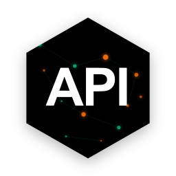

# API Hub Management Tools

<div align="center">
  
  <br><br>
  
  **API Hub Management Tools** 是一个现代化的桌面管理客户端，专为管理和监控多个 API 中转站而设计。
  
  基于 [Electron](https://www.electronjs.org/) + [React](https://react.dev/) + [TypeScript](https://www.typescriptlang.org/) 构建。

  [⬇️ 下载最新版](https://github.com/Sponge-Lu/API_detect_tools/releases)
</div>

---

## ✨ 核心特性

- **🚀 多站点聚合**：在一个界面统一管理无限数量的 API 站点（One API / New API / Veloera / Done Hub 等）。
- **🔐 自动认证**：无需手动复制 Token，软件自动启动浏览器并捕获登录凭证，支持 Cloudflare 智能绕过；批量检测时若站点未登录，会提示并等待登录后继续。
- **📊 实时监控**：一目了然地查看各站点余额、今日消耗、RPM/TPM 速率；批量检测时单站完成即刻刷新显示。
- **⚙️ 并发/超时可调**：默认超时 30 秒，默认并发 3，可在设置中调整并发开关与最大并发（1–5）。
- **🧭 浏览器更可控**：启动调试端口随机化、取消隐藏/后台启动，降低被杀软误报和端口冲突的概率。
- **🎁 一键签到**：自动检测支持签到的站点，一键领取每日额度福利，兼容 Veloera 和 New API 站点类型。
- **🔑 API Key 管理**：在桌面端直接创建、删除、分组管理 API Key，支持批量操作。
- **🎨 现代化 UI**：清爽明亮的界面设计，支持深色模式跟随系统自动切换。
- **🔧 CLI 兼容性测试**：检测站点对 Claude Code、Codex、Gemini CLI 等工具的支持情况，支持 Codex 双 API 测试和 Gemini CLI 双端点测试。
- **⚙️ CLI 配置管理**：统一配置对话框支持 CLI 开关、模型选择、配置预览和一键应用，配置文件包含测试结果注释和使用建议。
- **🛡️ 数据安全**：配置信息仅存储在本地，支持加密备份与恢复。
- **☁️ WebDAV 云端备份**：支持将配置备份到 WebDAV 云存储（坚果云、NextCloud 等），实现跨设备同步。
- **📈 Linux Do Credit**：查询 Linux Do 论坛积分数据，包括基准值、当前分、差值计算，以及完整账户信息（总收入、总支出、可用余额、信任等级、支付评分等）。展开详情可查看每日收支统计和交易记录。支持 LDC 充值功能，可直接向支持 LDC 支付的站点充值。

## 📚 文档导航

我们为您准备了详细的文档：

- **[📖 用户指南](docs/USER_GUIDE.md)**：详细的功能介绍、使用教程和常见问题解答。
- **[💻 开发指南](docs/DEVELOPMENT.md)**：开发环境搭建、代码规范和贡献流程。
- **[🏗️ 架构文档](docs/ARCHITECTURE.md)**：系统架构设计、核心模块说明和工作流解析。
- **[🔌 API 参考](docs/API_REFERENCE.md)**：完整的 API 接口定义和兼容性说明。
- **[📝 更新日志](CHANGELOG.md)**：查看版本更新历史和变更记录。

## 分形索引系统
- **分形多级索引系统**：https://github.com/Claudate/project-multilevel-index

## 🚀 快速开始 (开发环境)

```bash
# 1. 克隆仓库
git clone https://github.com/Sponge-Lu/API_detect_tools.git

# 2. 安装依赖
npm install

# 3. 启动开发环境
npm run dev

# 4. 构建应用
npm run dist
```

详细的开发说明请参考 [开发指南](docs/DEVELOPMENT.md)。

## 🤝 贡献

欢迎提交 Issue 和 Pull Request！请在提交前阅读 [开发指南](docs/DEVELOPMENT.md) 中的贡献规范。

## 📄 许可证

[MIT License](LICENSE)
