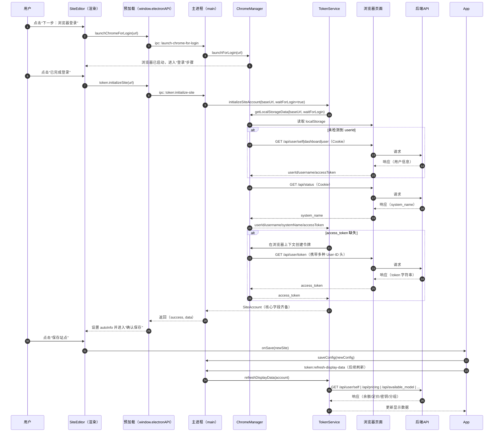

# 完成登录按钮后处理流程技术文档

版本：v1.0.0  
日期：2025-11-21

## 修改记录
- v1.0.0
  - 新增登录流程技术文档（接口清单、数据分析、UML时序图、代码引用）
  - 为前端 `SiteEditor` 关键处理函数添加中文函数级注释，覆盖浏览器登录触发、登录完成后的数据获取与错误分流、站点名称提取、保存流程说明

---

## 接口调用表格

### 登录完成后的核心获取与补全（浏览器 Cookie 环境）
| 接口 | 方法 | 触发条件 | 顺序 | 请求参数 | 请求头 | 响应示例 |
|---|---|---|---|---|---|---|
| `/api/user/self` | `GET` | localStorage 无 `userId` 或需补全 | 与下列端点轮询回退 | 无 | `Content-Type: application/json`，`credentials: include` | `{"success": true,"data": {"id": 123,"username": "alice","access_token": "xxx"}}` |
| `/api/user/dashboard` | `GET` | 上述端点失败回退 | 与上同 | 无 | 同上 | `{"success": true,"data": {"user_id": 123,"name": "alice"}}` |
| `/api/user` | `GET` | 上述端点失败回退 | 与上同 | 无 | 同上 | `{"id": 123,"user_name": "alice"}` |
| `/api/status` | `GET` | 需补全系统名 | 在用户信息后 | 无 | 同上 | `{"success": true,"data": {"system_name": "MySite"}}` |

代码位置：
- `src/main/chrome-manager.ts:886–1017`（用户信息 API 回退）
- `src/main/chrome-manager.ts:1020–1066`（系统名称）

### 访问令牌创建（浏览器 Cookie 环境）
| 接口 | 方法 | 触发条件 | 顺序 | 请求参数 | 请求头 | 响应示例 |
|---|---|---|---|---|---|---|
| `/api/user/token` | `GET` | `access_token` 缺失 | 用户信息成功后 | 无 | `Content-Type: application/json`；携带 Cookie；并同时发送多种用户ID头：`New-API-User`、`Veloera-User`、`voapi-user`、`User-id` | `{"success": true,"data": "ACCESS_TOKEN_STRING"}` |

代码位置：
- `src/main/token-service.ts:136–254`

### 登录后展示数据刷新（服务端 Bearer Token 环境）
| 接口 | 方法 | 触发条件 | 顺序 | 请求参数 | 请求头 | 响应示例 |
|---|---|---|---|---|---|---|
| `/api/user/self` | `GET` | 需要刷新余额/用量 | 并行 | 无 | `Authorization: Bearer <token>`；`Content-Type: application/json`；多种用户ID头 | `{"success": true,"data": {"quota": 100,"today_quota_consumption": 5,"can_check_in": true}}` |
| `/api/pricing` | `GET` | 需要模型定价 | `/api/available_model` 回退 | 无 | 同上 | `{"success": true,"data": [{"model_name":"glm-4","model_price":0.001,"quota_type":0}]}` |
| `/api/available_model` | `GET` | `/api/pricing` 不可用 | 与上互斥 | 无 | 同上 | `{"success": true,"data": {"GLM-4": {"price":{"input":0.0005,"output":0.001},"groups":["default"]}}}` |
| `/api/token/`（多变体） | `GET` | 刷新 API Keys | 并行 | 查询参数随站点类型变化 | 同上 | `{"success": true,"data": {"items": [{"id":1,"group":"default"}]}}` |
| `/api/user/self/groups`、`/api/user_group_map`、`/api/group` | `GET` | 刷新分组 | 并行 | 无 | 同上 | `{"success": true,"data": {"default":{"desc":"默认","ratio":1}}}` |

代码位置：
- 账户数据：`src/main/token-service.ts:675–711`、`src/main/token-service.ts:256–315`
- 模型定价：`src/main/token-service.ts:1147–1481`
- API Keys：`src/main/token-service.ts:716–950`
- 用户分组：`src/main/token-service.ts:955–1046`、`src/main/token-service.ts:1051–1145`

### 签到相关（可选）
| 接口 | 方法 | 触发条件 | 顺序 | 请求头 | 响应示例 |
|---|---|---|---|---|---|
| `/api/user/check_in_status` | `GET` | 展示签到状态 | 刷新时 | `Authorization: Bearer <token>` + 用户ID头 | `{"success": true,"data": {"can_check_in": true,"checked_in_days": 3}}` |
| `/api/user/check_in` | `POST` | 执行签到 | 用户操作 | 同上 | `{"success": true,"message": "签到成功","data": {"reward": 5000}}` |

代码位置：
- `src/main/token-service.ts:444–544`（状态）
- `src/main/token-service.ts:555–673`（签到）

---

## 数据字段分类表格

| 字段 | 来源 | 必要性 | 用途 |
|---|---|---|---|
| `user_id` | localStorage/回退API | 必要 | 作为认证主体，用于生成令牌与后续请求头 |
| `access_token` | localStorage/`/api/user/token` | 必要 | 后续所有受保护接口的 Bearer 认证 |
| `site_name`/`system_name` | localStorage/`/api/status` | 必要 | 前端显示与站点标识，默认用于初次命名 |
| `username` | localStorage/回退API | 非必要 | 辅助信息展示 |
| `supportsCheckIn` | localStorage/`/api/status` | 非必要 | 站点是否支持签到逻辑控制 |
| `canCheckIn` | localStorage/`/api/user/check_in_status` | 非必要 | 当前是否可签到，决定前端按钮状态 |
| `quota`/`today_*` | `/api/user/self` | 非必要 | 展示余额、当日使用量等统计信息 |
| `apiKeys` | `/api/token/`（多变体） | 非必要 | 展示密钥列表，辅助管理 |
| `userGroups` | `/api/user/self/groups` 等 | 非必要 | 展示与比率计算（如模型分组） |
| `modelPricing` | `/api/pricing` 或 `/api/available_model` | 非必要 | 展示模型价格与支持组，辅助显示 |

说明：
- 必要字段为保存站点与后续刷新不可或缺的核心认证信息：`user_id`、`access_token`、`site_name/system_name`。
- 非必要字段用于丰富界面与后续功能（签到、统计、密钥、分组、定价），获取失败不阻塞登录成功。

---

## 时序流程图



---

## 客户端本地处理逻辑

- 步骤状态管理
  - `SiteEditor` 使用 `step: 'input-url' | 'login' | 'fetching' | 'confirm'` 管理流程
  - “下一步：浏览器登录”→ `step='login'`；“已完成登录”→ `step='fetching'`；成功→ `step='confirm'`
- 数据存储与持久化
  - 登录完成后填充 `autoInfo`：`name`、`userId`、`systemToken(access_token)`、`enableCheckin`
  - 保存时通过 `onSave` 将 `SiteConfig` 传至父组件，主进程持久化配置
- 关键业务判断与异常处理
  - 超时保护（30秒）：超时提示并回到 `input-url`
  - 浏览器关闭/操作取消：提示重新点击“浏览器登录”，回到 `input-url`
  - 认证失败（401/403/404）：中文映射提示，提供手动填入或重新登录
  - 站点不支持自动创建 Token：引导用户手动生成并填写
- 后续刷新策略
  - 使用 Bearer Token 并同时附带多种 `User-ID` 请求头，兼容不同站点

---

## 关键代码片段引用

- 启动浏览器登录按钮事件
  - `src/renderer/components/SiteEditor.tsx:41–64`
- 已完成登录按钮与错误分流
  - `src/renderer/components/SiteEditor.tsx:66–163`
- 重新登录流程跳转
  - `src/renderer/components/SiteEditor.tsx:521–546`
- 保存站点
  - `src/renderer/components/SiteEditor.tsx:190–208`
- 预加载 API 暴露
  - `src/main/preload.ts:3–53`
- IPC 处理：浏览器启动、站点初始化、刷新展示数据
  - `src/main/main.ts:88–91`、`146–154`、`156–167`
- 浏览器控制与登录检测（localStorage + API 回退）
  - `src/main/chrome-manager.ts:396–412`、`414–527`、`565–656`、`886–1066`
- 令牌创建与刷新展示数据
  - `src/main/token-service.ts:34–135`、`136–254`、`256–315`、`675–1481`

---

## 验证要点

- 必要字段保证：
  - `user_id` 与 `access_token` 在进入“确认保存”前必须存在，否则走错误分流或引导手动填写
- 环境切换：
  - 登录阶段以浏览器 Cookie 为主；刷新阶段使用 Bearer Token（并行调用）
- 健壮性：
  - 浏览器关闭、Cookie过期、Cloudflare拦截均有对应提示与回退策略

---

## 备注
本文件为开发内部技术文档，供定位“完成登录”按钮后的完整处理流与接口兼容策略参考。

---

## 控制台JS方案与导入

### 场景说明
- 用户已在目标站点的真实浏览器中完成登录。
- 在同源页面控制台执行以下脚本，脚本会：
  - 优先从 `localStorage` 读取 `user_id/access_token/system_name` 等；
  - 不完整时回退调用同源接口（携带 Cookie）：`/api/user/self|dashboard|user` 与 `/api/status`；
  - 若仍无令牌，尝试 `GET /api/user/token` 并附带多种用户ID请求头；
  - 最终输出可粘贴到应用的 JSON 结构。

### 输出数据契约
```json
{
  "site_url": "https://example.com",
  "site_name": "MySite",
  "user_id": 123,
  "username": "alice",
  "access_token": "...",
  "supportsCheckIn": true,
  "canCheckIn": false
}
```

### 控制台脚本（直接复制到已登录站点页面控制台执行）
```js
(async () => {
  const origin = location.origin.replace(/\/$/, '');

  const parseJSON = (str) => { try { return JSON.parse(str); } catch { return null; } };
  const pick = (obj, keys) => keys.reduce((v, k) => v ?? obj?.[k], undefined);

  const scanStoresForToken = (stores) => {
    let token = null;
    for (const store of stores) {
      for (let i = 0; i < store.length; i++) {
        const key = store.key(i);
        const val = store.getItem(key);
        if (!val) continue;
        const obj = parseJSON(val);
        if (obj && typeof obj === 'object') {
          const ks = ['access_token','accessToken','token','auth_token','authToken','api_token','bearer_token'];
          for (const k of ks) { const v = obj[k]; if (typeof v === 'string' && v.length > 15) token = token || v; }
        } else if (typeof val === 'string') {
          const m = val.match(/[A-Za-z0-9-_]+\.[A-Za-z0-9-_]+\.[A-Za-z0-9-_]+/);
          if (m && m[0] && m[0].length > 30) token = token || m[0];
        }
      }
    }
    return token;
  };

  const readCookieToken = () => {
    const map = {};
    document.cookie.split(';').forEach(p => { const [k, ...rest] = p.split('='); if (!k) return; map[k.trim()] = rest.join('=').trim(); });
    const ks = ['access_token','token','auth_token','api_token','bearer_token'];
    for (const k of ks) { const v = map[k]; if (v && v.length > 15) return v; }
    for (const k of Object.keys(map)) { const v = map[k]; const m = v && v.match(/Bearer\s+([^;\s]+)/i); if (m && m[1]) return m[1]; }
    return null;
  };

  const readLocal = () => {
    const s = window.localStorage;
    const ss = window.sessionStorage;

    const user = parseJSON(s.getItem('user'));
    const siteInfo = parseJSON(s.getItem('siteInfo'));
    const userInfo = parseJSON(s.getItem('userInfo'));
    const config = parseJSON(s.getItem('config') || s.getItem('siteConfig'));
    const status = parseJSON(s.getItem('status') || s.getItem('siteStatus'));
    const checkIn = parseJSON(s.getItem('checkIn') || s.getItem('check_in'));

    const user_id = (
      pick(user, ['id','user_id','userId','uid','user_ID']) ??
      pick(siteInfo, ['id','user_id','userId','uid']) ??
      pick(userInfo, ['id','user_id','userId']) ??
      (s.getItem('user_id') || s.getItem('userId') || s.getItem('uid') || s.getItem('id'))
    );

    const username = (
      pick(user, ['username','name','display_name','displayName','nickname','login']) ??
      pick(siteInfo, ['username','name','display_name','user_name']) ??
      pick(userInfo, ['username','name']) ??
      (s.getItem('username') || s.getItem('user_name') || s.getItem('nickname'))
    );

    const system_name = (
      pick(siteInfo, ['system_name','systemName','site_name','siteName','name']) ??
      pick(config, ['system_name','systemName','site_name','name']) ??
      (s.getItem('system_name') || s.getItem('systemName') || s.getItem('site_name') || s.getItem('siteName') || s.getItem('app_name'))
    );

    const tokenFromKnown = (
      pick(user, ['access_token','accessToken','token','auth_token','authToken','api_token','bearer_token']) ??
      pick(siteInfo, ['access_token','accessToken','token']) ??
      (parseJSON(s.getItem('auth') || s.getItem('authentication'))?.access_token) ??
      (s.getItem('access_token') || s.getItem('accessToken') || s.getItem('token') || s.getItem('auth_token') || s.getItem('authToken') || s.getItem('api_token') || s.getItem('apiToken') || s.getItem('bearer_token'))
    );
    const tokenFromScan = scanStoresForToken([s, ss]);
    const tokenFromCookie = readCookieToken();
    const access_token = tokenFromKnown || tokenFromScan || tokenFromCookie || null;

    const supportsCheckIn = siteInfo?.check_in_enabled ?? status?.check_in_enabled ?? checkIn?.enabled ?? null;
    const canCheckIn = user?.can_check_in ?? checkIn?.can_check_in ?? null;

    return { user_id, username, system_name, access_token, supportsCheckIn, canCheckIn };
  };

  const getJSON = async (url) => {
    const resp = await fetch(url, { method: 'GET', credentials: 'include', headers: { 'Content-Type': 'application/json', 'Cache-Control': 'no-store', 'Pragma': 'no-cache' } });
    const text = await resp.text();
    if (!resp.ok) throw new Error(`HTTP ${resp.status}`);
    if (text.includes('<!DOCTYPE')) throw new Error('被拦截或挑战页面');
    try { return JSON.parse(text); } catch { throw new Error('not valid JSON'); }
  };

  const readViaApi = async () => {
    const candidates = ['/api/user/self', '/api/user/dashboard', '/api/user'];
    let user = {};
    for (const p of candidates) {
      try {
        const data = await getJSON(`${origin}${p}`);
        const u = data?.data ?? data;
        if (u?.id || u?.user_id) {
          user.user_id = u.id ?? u.user_id ?? u.userId ?? u.uid ?? u.user_ID;
          user.username = u.username ?? u.name ?? u.display_name ?? u.displayName ?? u.nickname ?? u.login ?? u.user_name;
          user.access_token = u.access_token ?? u.accessToken ?? u.token ?? u.auth_token ?? u.authToken ?? u.api_token ?? u.bearer_token;
          break;
        }
      } catch (e) { /* ignore and try next */ }
    }
    let system_name = null;
    try {
      const s = await getJSON(`${origin}/api/status`);
      system_name = s?.data?.system_name ?? s?.data?.systemName ?? s?.data?.site_name ?? s?.data?.name ?? s?.system_name ?? s?.systemName ?? null;
    } catch (e) { /* ignore */ }
    return { ...user, system_name };
  };

  const createTokenIfMissing = async (user_id) => {
    if (!user_id) return null;
    const headers = {
      'Content-Type': 'application/json',
      'New-API-User': String(user_id),
      'Veloera-User': String(user_id),
      'voapi-user': String(user_id),
      'User-id': String(user_id),
      'Cache-Control': 'no-store',
      'Pragma': 'no-cache'
    };
    try {
      const resp = await fetch(`${origin}/api/user/token`, { method: 'GET', credentials: 'include', headers });
      const text = await resp.text();
      if (!resp.ok) throw new Error(`HTTP ${resp.status}`);
      const data = JSON.parse(text);
      if (typeof data === 'string' && data.length > 10) return data;
      if (data?.data && typeof data.data === 'string') return data.data;
      if (data?.token && typeof data.token === 'string') return data.token;
      if (data?.data?.token && typeof data.data.token === 'string') return data.data.token;
      throw new Error(data?.message || '创建令牌失败');
    } catch (e) { return null; }
  };

  // 主流程
  const local = readLocal();
  const api = (!local.user_id || !local.access_token) ? await readViaApi() : {};
  const merged = { ...local, ...api };
  if (!merged.access_token) merged.access_token = await createTokenIfMissing(merged.user_id);

  const payload = {
    site_url: origin,
    site_name: merged.system_name || new URL(origin).hostname,
    user_id: merged.user_id,
    username: merged.username || null,
    access_token: merged.access_token,
    supportsCheckIn: merged.supportsCheckIn ?? null,
    canCheckIn: merged.canCheckIn ?? null
  };

  console.log('控制台导出JSON如下，复制并粘贴到应用：');
  const out = JSON.stringify(payload);
  console.log(out);
  try { await navigator.clipboard.writeText(out); console.log('已复制到剪贴板'); } catch { /* ignore */ }
})();
```

### 在应用中导入
- 打开“智能添加站点”对话框的“输入URL”步骤，找到“🧩 控制台数据导入”区域。
- 将控制台打印的 JSON 粘贴到文本框，点击“导入并进入确认”。
- 在“确认保存”页面核对信息后点击“保存站点”，应用将使用 Bearer Token 直接刷新展示数据。
